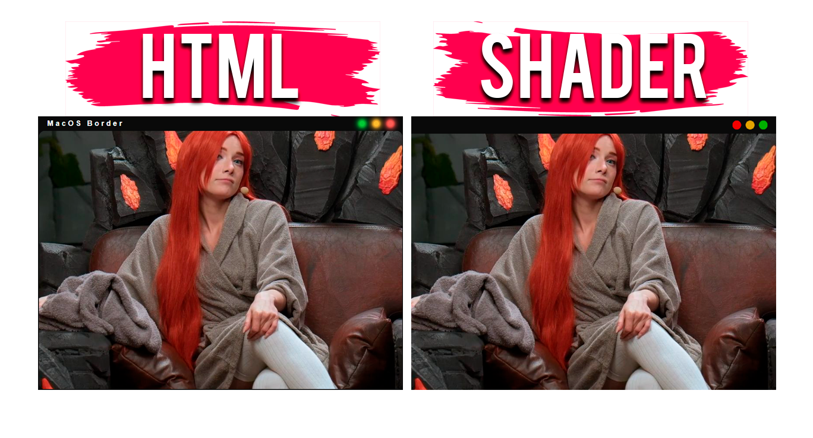

# MacOS рамка для OBS

Минималистичная рамка для OBS, которую можно использовать при записи, либо стримах. Изменять размеры можно через плагин <a href="https://obsproject.com/forum/resources/move.913/" target="_blank">Move Transition</a>.

## Версия html
1. Скачиваем html файл
2. Добавляем источник браузера и выбираем 