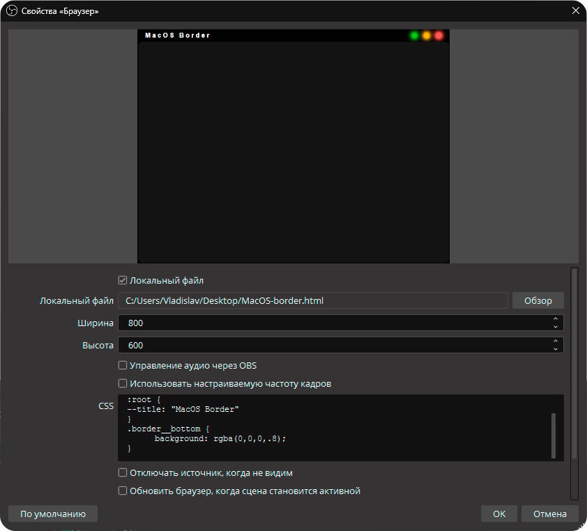
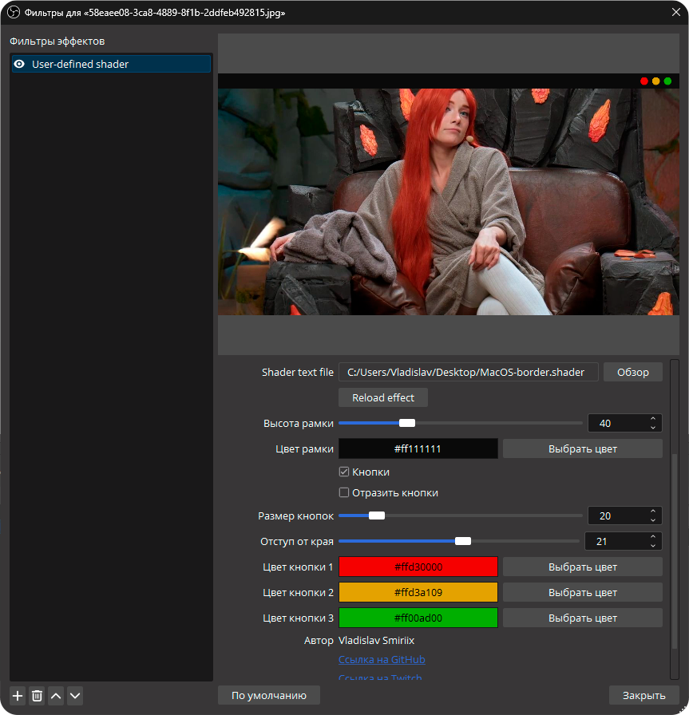

# MacOS рамка для OBS

<p>Минималистичная рамка для OBS, которую можно использовать при записи, либо стримах. Изменять размеры можно через плагин <a href="https://obsproject.com/forum/resources/move.913/" target="_blank">Move Transition</a>.</p>
<p>Реализация была выполнена в двух вариациях: html файл (через источник "браузер") и шейдер для плагина <a href="https://obsproject.com/forum/resources/obs-shaderfilter.1736/">ShaderFilter</a>.</p>
<p align='center'></p>

## 🔗 Версия рамки через html документ
1. Скачиваем html файл с рамкмой - <a href="https://github.com/Smiriix/twitch/blob/main/MacOS-border.html" target="_blank">ссылка</a>;
2. Добавляем источник браузера в OBS и выбираем html документ;
3. Задать размеры источника (ширина и высота) под нужный элемент сцены;
4. Редактируем под себя, если требуется.

### 🖊️ Редактирование рамки
<p>Редактировать рамку можно через CSS стили в источнике. Ниже привидены примеры кода, который можно вставить:</p>

1. Задать заголовок рамки:
```css
--root {
    --title: 'Заголовок рамки';
}
```

2. Задать фон в рамке, если требуется задать сверху поместить чат
```css
.border__bottom {
	background: rgba(0,0,0,.8);
}
```

3. Поменять цвет рамки
```css
:root {
    --borderColor: #111;
}
```

4. Поменять радиус закругления внутри рамки, если требуется
```css
:root {
    --size: 15px;
}
```



*Если разбираетесь в HTML, CSS и JS, то можете скидывать ссылки на свои форки в ЛС, буду добавлять ссылки на другие версии рамки*
<p><br></p>
<p><br></p>

## ✨ Версия рамки через шейдер

1. Устанавливаем плагин <a href="https://obsproject.com/forum/resources/obs-shaderfilter.1736/">ShaderFilter</a> в OBS;
2. Скачиваем шейдер и накидываем его в фильтрах источника.

### 🖊️ Редактирование рамки

Редактирование происходит через интерфейс: полузнки и палитру цветов.


*На GLSL/HLSL опыта написания кода не было, из-за чего функционал получился не большим.*

<p><br></p>

## 👤 [Автор рамок]:
- Никнейм: Smiriix
- <a href="http://twitch.tv/smiriix">Twitch</a>
- <a href="http://t.me/smiriix_public">Telegram (Канал)</a>
- <a href="http://t.me/smiriix">Telegram (ЛС)</a>